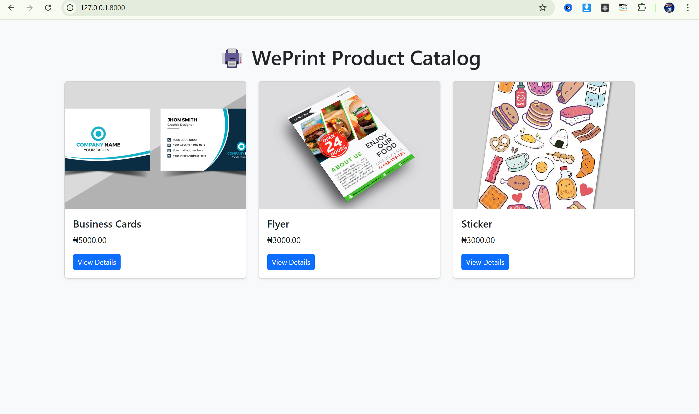
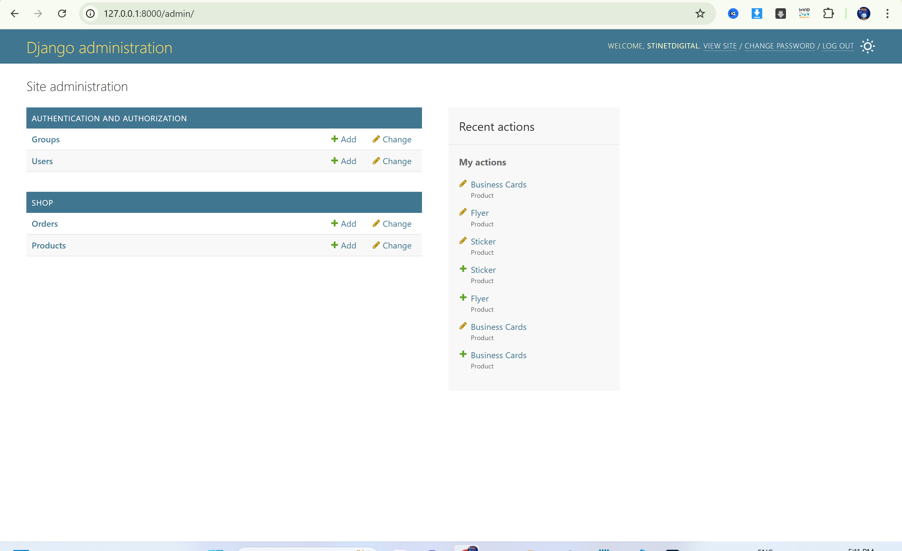

# weprint-django
# 🖨️ WePrint Django E-Commerce

**WePrint** is a custom-built online printing store made with Django. It allows users to view and order printed products like business cards, flyers, and more — all through a smooth interface.

---

## 🔧 Features

- ✅ User login & admin dashboard
- ✅ Product listing with image and price
- ✅ Order form and success page
- ✅ Image upload support (media folder)
- ✅ Admin can manage products (add/edit/delete)

---

## 💻 Tech Stack

- Python 3 & Django 5
- SQLite3 (default DB)
- HTML5 + CSS3 + Bootstrap
- Git & GitHub for version control

---

## 🖼️ Screenshots

(Add screenshots in `/screenshots/` folder or upload in GitHub UI)

---

## 🚀 How to Run the Project Locally

# 1. Clone the project
git clone https://github.com/ugbedethomas/weprint-django.git

# 2. Move into project directory
cd weprint-django

# 3. Create and activate virtual environment
python -m venv venv
venv\Scripts\activate

# 4. Install dependencies
pip install -r requirements.txt

# 5. Run the development server
python manage.py runserver

👤 Author
Augustine Ugbede Thomas
Founder, Stinet Digital
🔗 GitHub
📍 Abuja, Nigeria
📧 Email: info@stinetdigital.com.ng

📝 License
This project is licensed under the MIT License — feel free to use, modify, or build on it for learning or client demos.
However, reselling or republishing the project as-is is not allowed without permission.

